  

  

  
  
  

---

### ⚡ Live Contribution Snake

  <picture>
    <source media="(prefers-color-scheme: dark)" srcset="https://raw.githubusercontent.com/muqeetahmaad9/muqeetahmaad9/output/github-contribution-grid-snake-dark.svg">
    <source media="(prefers-color-scheme: light)" srcset="https://raw.githubusercontent.com/muqeetahmaad9/muqeetahmaad9/output/github-contribution-grid-snake.svg">
    
  </picture>

### 👨‍💻 About Me

- 🔭 Passionate about **AI/ML**, and enjoy combining it with real-world **embedded & IoT** systems.
- 🌱 Currently exploring machine learning, data-driven applications, and smart hardware projects.
- 🛠️ Built projects spanning IoT (RFID access control, temperature monitoring), embedded systems (RTC digital clock), and applied ML/data apps (weather & news apps).
- 🌐 Portfolio: [muqeetahmaad-portfolio.netlify.app](https://muqeetahmaad-portfolio.netlify.app/)
- 📍 Based in Attock, Pakistan
- 📫 Reach me at **muqeetahmad155@gmail.com**

### 🚀 Featured Projects

| Project | Description |
|---|---|
| [crowd-density-estimator](https://github.com/muqeetahmaad9/crowd-density-estimator) | ML model estimating crowd density from image/video data |
| [student-performance-internship](https://github.com/muqeetahmaad9/student-performance-internship) | Student performance analysis using machine learning |
| [climate-full-stack](https://github.com/muqeetahmaad9/climate-full-stack) | Full-stack climate data application (TypeScript) |
| [RFID-Door-Lock](https://github.com/muqeetahmaad9/RFID-Door-Lock) | RFID-based smart access control system |
| [IoT-Temperature-Monitor](https://github.com/muqeetahmaad9/IoT-Temperature-Monitor) | Real-time temperature monitoring over IoT |
| [Digital-Clock-RTC](https://github.com/muqeetahmaad9/Digital-Clock-RTC) | Digital clock built with a real-time clock (RTC) module |

### 🧰 Languages & Tools

  
  

### 📊 GitHub Stats

  
  

  

**🏆 Trophies**

  

  

